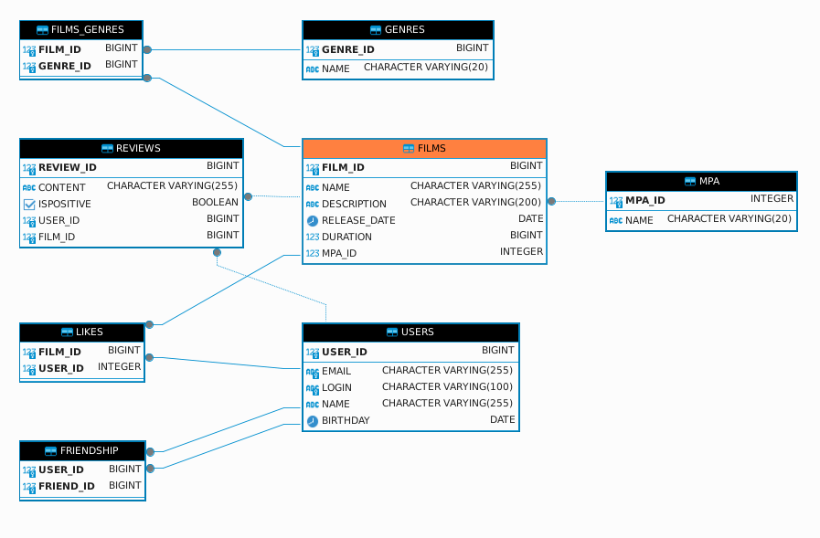

# Java Filmorate

## Описание проекта
**Java Filmorate** — это платформа для пользователей, которая помогает находить, оценивать и рекомендовать фильмы на основе рейтингов и лайков. Основная цель проекта — предоставить пользователям возможность следить за предпочтениями друзей и получать рекомендации фильмов, основываясь на взаимодействиях с фильмами. Проект разрабатывался в команде и ориентирован на отработку навыков коллективной разработки, а также на улучшение навыков построения REST API и работы с реляционными базами данных.

### Основной стек технологий:
- Java 21
- Spring Boot
- Hibernate
- PostgreSQL
- Lombok
- JUnit
- Mockito
- Docker

Проект был разработан с целью улучшения навыков работы с многослойной архитектурой, создания гибкой и масштабируемой системы, а также интеграции между различными компонентами. Каждый участник команды взял на себя ответственность за определенные части кода, что позволило отработать навыки совместной работы и коллективного принятия решений.

## Инструкция по развёртыванию

### Системные требования
- Java 21
- Maven 3.6+
- Docker (для запуска базы данных)

### Шаги для развёртывания
1. Клонируйте репозиторий:
   ```bash
   git clone https://github.com/Roman-Kopytov/java-filmorate.git
   ```

2. Перейдите в директорию проекта:
   ```bash
   cd java-filmorate
   ```

3. Соберите проект с помощью Maven:
   ```bash
   mvn clean install
   ```

4. Для локальной работы с базой данных PostgreSQL, запустите Docker-контейнер:
   ```bash
   docker-compose up -d
   ```

5. Запустите приложение:
   ```bash
   java -jar target/filmorate-0.0.1-SNAPSHOT.jar
   ```

6. Приложение будет доступно по адресу:
   ```
   http://localhost:8080
   ```

7. Для тестирования и проверки можно использовать коллекцию Postman, которая находится в корне проекта (`filmorate.postman_collection.json`).

## Планы по доработке
- **Оптимизация производительности запросов**: Улучшить работу с базой данных с помощью индексов и оптимизаций запросов, чтобы ускорить работу при большом количестве пользователей.
- **Реализация системы рекомендаций**: Добавить механизм персональных рекомендаций на основе поведения пользователей и их взаимодействий с фильмами.
- **Интеграция с внешними сервисами**: Добавить возможность получать информацию о фильмах из внешних API (например, IMDb API).

## Дополнительно
- В проекте реализованы кастомные исключения и глобальный обработчик ошибок для улучшенной обработки ошибок и уведомлений пользователей.
- Проект включает модульные и интеграционные тесты для обеспечения стабильности работы кода.
- CI/CD настроен с помощью GitHub Actions для автоматического тестирования и сборки проекта при каждом коммите.

## Участники проекта
- [Roman Kopytov](https://github.com/Roman-Kopytov) — разработка основных функций API и интеграция с базой данных.
- [uthbq](https://github.com/uthbq) — работа над системой рекомендаций и обработкой ошибок.
- [Perminand](https://github.com/Perminand) — тестирование и работа над функциональностью рейтингов и лайков.
- [DanielDaze](https://github.com/DanielDaze) — настройка CI/CD и интеграционные тесты.
  
```